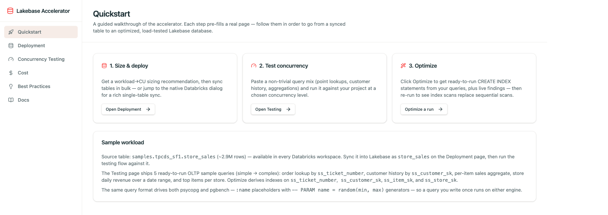
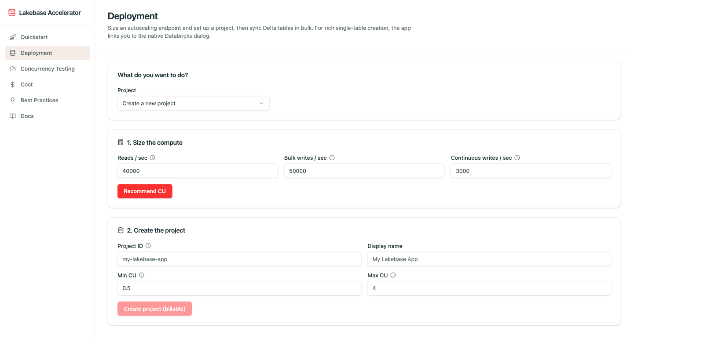
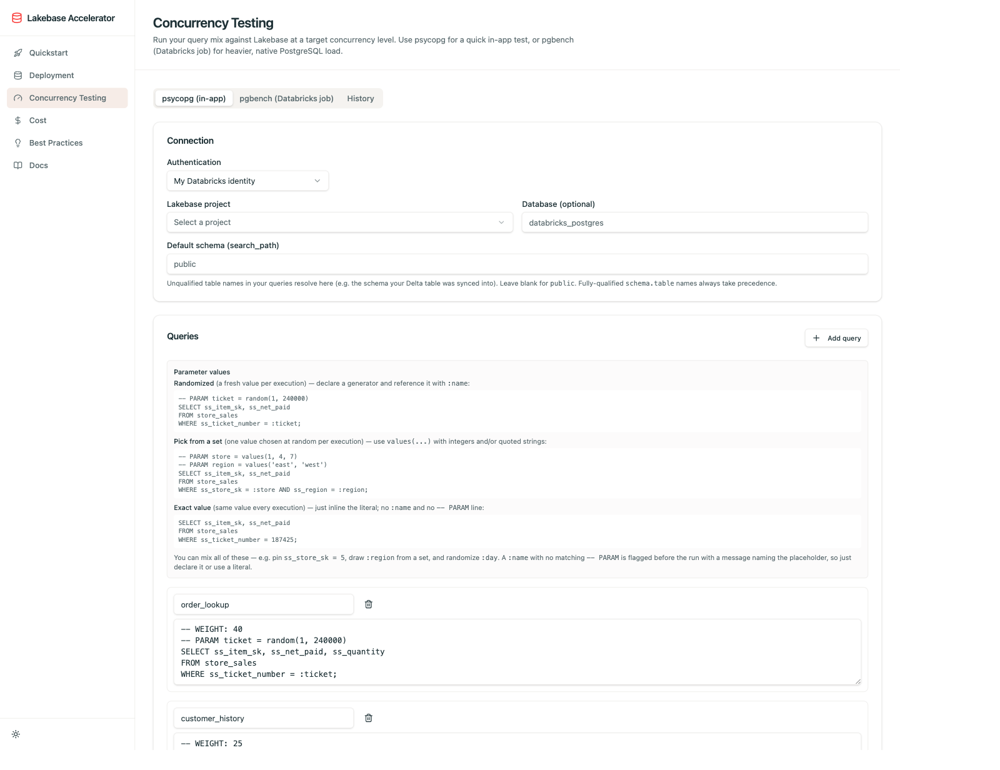
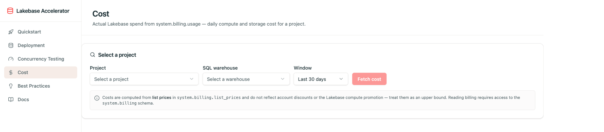
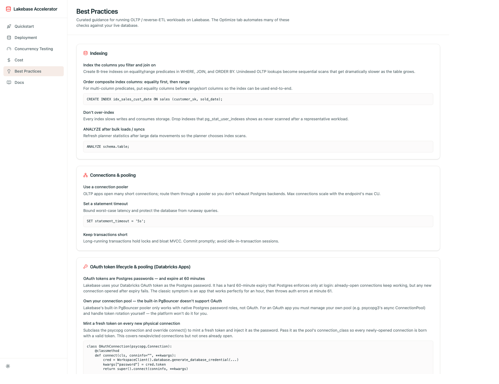

# Lakebase POC Accelerator ✨

A full-stack web app for running **OLTP / reverse-ETL proof-of-concepts on
[Lakebase](https://www.databricks.com/product/lakebase)** (Databricks-managed Postgres).
It takes you end to end — from a synced Delta table to a **sized, deployed, load-tested,
and index-optimized** Lakebase database — without leaving the browser.

The native Databricks UI already creates and manages Lakebase. This app adds everything
*around* deployment that the platform doesn't: workload → compute sizing, concurrency
testing (psycopg **and** pgbench), before/after index optimization with live database
findings, run-history persistence, and actual-spend reporting. In short: **the native UI
deploys Lakebase; this app proves it's fast and tells you how to make it faster.**

> 👩‍💻 Want to run it locally, change the code, or contribute? See **[CONTRIBUTING.md](./CONTRIBUTING.md)**.

---

## 🚀 Getting started (using the deployed app)

1. **Open the app.** Your admin deploys it as a Databricks App and shares the URL
   (e.g. `https://lakebase-accelerator-<workspace>.databricksapps.com`). Sign in with
   your Databricks identity — no separate account or password.
2. **Follow the Quickstart page.** It's a guided walkthrough; each step pre-fills a real
   page so you can go from a synced table to an optimized database in order.
3. **Try the sample workload.** Every Databricks workspace has
   `samples.tpcds_sf1.store_sales` (~2.9M rows). Sync it as `store_sales` on the
   Deployment page, then run the bundled sample queries through Testing → Optimize.

### The end-to-end flow: **Deploy → Test → Optimize**

| Step | Page | What you do |
|------|------|-------------|
| 1️⃣ **Size & deploy** | Deployment | Get a workload→CU sizing recommendation, create/inspect a project, and bulk-sync Delta tables into Lakebase. |
| 2️⃣ **Test concurrency** | Concurrency Testing | Point at a project, paste your query mix, pick a concurrency level, and run — get throughput, success rate, and latency percentiles. |
| 3️⃣ **Optimize** | Concurrency Testing → Optimize | Get ready-to-run `CREATE INDEX` statements derived from your queries, apply them, and re-run to see index scans replace sequential scans. |


---

## 📥 Installing & deploying to a Databricks workspace

This section is for whoever **installs the app** into a workspace (typically a workspace
admin). Once deployed, end users just open the URL and sign in — see
[Getting started](#-getting-started-using-the-deployed-app) above.

### 1. Prerequisites

You need a **Databricks workspace with Lakebase enabled**, plus these tools on your
machine:

| Tool | Purpose | Install |
|------|---------|---------|
| **[Databricks CLI](https://docs.databricks.com/dev-tools/cli/)** | Auth + bundle deploy | `brew install databricks` (or see docs) |
| **Python ≥ 3.11** | Backend runtime (`.python-version` → `3.11`) | [python.org](https://www.python.org/) |
| **[uv](https://docs.astral.sh/uv/)** | Python packages (not pip) | `curl -LsSf https://astral.sh/uv/install.sh \| sh` |
| **[bun](https://bun.sh/)** | JS packages (not npm) | `curl -fsSL https://bun.sh/install \| bash` |
| **[apx](https://github.com/databricks-solutions/apx)** | Builds the app bundle | See the apx repo |

### 2. Get the code & install required packages

```bash
git clone <repo-url> && cd lakebase-poc-accelerator

uv sync        # install Python dependencies into .venv (FastAPI, databricks-sdk, psycopg 3, …)
bun install    # install JS/frontend dependencies
```

### 3. Authenticate to the target workspace

```bash
databricks auth login --host https://<your-workspace>.databricks.com --profile <profile>
databricks auth profiles          # verify the profile shows "YES"
```

### 4. Deploy the app

`apx build` compiles the frontend + backend; the Databricks Asset Bundle then uploads the
code and creates the Databricks App.

```bash
# Validate the bundle against a target defined in databricks.yml
databricks bundle validate -p <profile> -t <target>

# Deploy (runs `apx build`, uploads code, creates/updates the App resource)
databricks bundle deploy -p <profile> -t <target>

# Start the app so it serves the new code — prints the app URL when done
databricks bundle run lakebase-accelerator-app -p <profile> -t <target>
```

`databricks.yml` defines the deploy **targets** — `dev` (default) and `qa` (bound to a
specific workspace host). Each target keeps separate state, so deployments never collide.
Omit `-t` to use the default `dev` target. Share the printed app URL with your users.

### 5. Grant the app permission to run pgbench (one-time)

The pgbench load test runs as a Databricks Job on a dedicated single-node cluster the
app's service principal **creates and owns per workspace** (one fixed-size cluster,
reused across runs). If a run fails with
`PERMISSION_DENIED: You are not authorized to create clusters`, grant the app's service
principal the **"Allow unrestricted cluster creation"** entitlement:

> Settings → Identity and access → Service principals → select the app's SP
> (`app-… <app-name>`) → Entitlements → enable *Allow unrestricted cluster creation*.

The app surfaces this exact suggestion in a failed run's error box. It also detects a
workspace **IP access list** rejection and reports the exact source IP to allow.

Users also need their Databricks identity permitted on the target Lakebase project's
**Database connections** (access is governed by the Lakebase OAuth Postgres role).

> 🧑‍💻 To run the app **locally** for development instead of deploying, see
> **[CONTRIBUTING.md](./CONTRIBUTING.md)**.

---

## 🧭 Capabilities

### Deployment — size & sync
Size an autoscaling endpoint from your expected reads/writes, set up or inspect a
Lakebase project, and **sync Delta tables into Lakebase in bulk** (snapshot, triggered,
or continuous). For rich single-table creation, the app links you straight to the native
Databricks dialog.



### Concurrency Testing — psycopg & pgbench
Run your query mix against Lakebase at a **target concurrency level**, and get
throughput (TPS), success rate, and latency percentiles (p50/p95/p99).

- **psycopg (in-app)** — a quick, in-process test for fast iteration.
- **pgbench (Databricks job)** — heavier, native PostgreSQL load run as a Databricks
  Job on a single-node cluster.

> **Note:** pgbench is a single-process load generator — it runs entirely on the
> cluster's driver and uses **no Spark workers** (the cluster is single-node by design).
> Higher concurrency is served by a **bigger single node** (more vCPUs/RAM), not more
> nodes: threads (`-j`) map to cores and each client (`-c`) costs load-generator memory.
> The cluster is a fixed max-tier single node (64 vCPU / 256 GB) shared across all runs,
> so per-run concurrency never resizes it and pgbench itself is never the bottleneck.
- **History** tab — each psycopg run can be saved (to your browser, or opt-in to the
  connected Lakebase project) for later comparison.

One **unified query format** drives *both* engines — a query you author once runs on
either. It's SQL with pgbench-style `:name` placeholders plus optional comment
directives:

```sql
-- WEIGHT: 40                          -- pgbench relative transaction weight (psycopg ignores)
-- EXEC_COUNT: 20                       -- how many times psycopg runs this (pgbench ignores)
-- PARAM ticket = random(1, 240000)     -- fresh random value per execution
SELECT ss_item_sk, ss_net_paid
FROM store_sales
WHERE ss_ticket_number = :ticket;
```



### Optimize — indexes & live findings
From a test run, get ready-to-run `CREATE INDEX` statements derived from your queries,
plus **live database findings** — sequential scans, cache-hit ratio, and unused indexes.
Apply the indexes and re-run to compare the EXPLAIN plans **before vs. after**.

### Cost — actual spend
See real Lakebase spend from `system.billing.usage` — daily compute and storage cost for
a project. (Load-generator compute — the pgbench job / this app — is excluded; that's
client-side cost, not Lakebase.)



### Best Practices & Docs
Curated guidance for running OLTP / reverse-ETL workloads on Lakebase (the Optimize tab
automates many of these checks against your live database), plus an in-app Docs page that
explains the whole flow, the query format, authentication, and run-history permissions.



---

## 🔐 Authentication

The app **never uses a static username & password** — that's the least secure option for
Lakebase and is intentionally unsupported. Instead:

- **My Databricks identity (OBO)** — when deployed as a Databricks App, the app reaches
  Lakebase using *your* logged-in identity (on-behalf-of). **This is the recommended
  path** and requires no setup.
- **OAuth token (dev only)** — paste an endpoint host, your Postgres user, and a
  short-lived token from Lakebase Connect. Intended for local development; tokens expire
  after ~1 hour.

To connect, the target Lakebase project's **Database connections** must permit your
identity — access is controlled entirely by the Lakebase OAuth Postgres role, not by app
settings.

---

<p align="center">Built with ❤️ using <a href="https://github.com/databricks-solutions/apx">apx</a> · See <a href="./CONTRIBUTING.md">CONTRIBUTING.md</a> to develop locally</p>
